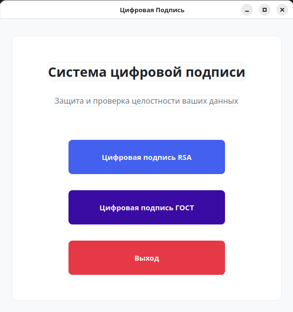
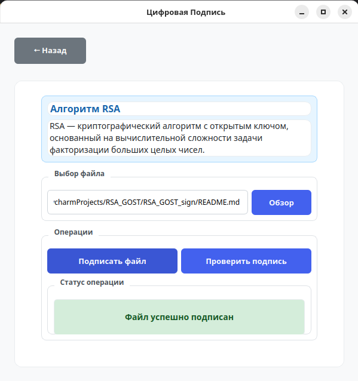
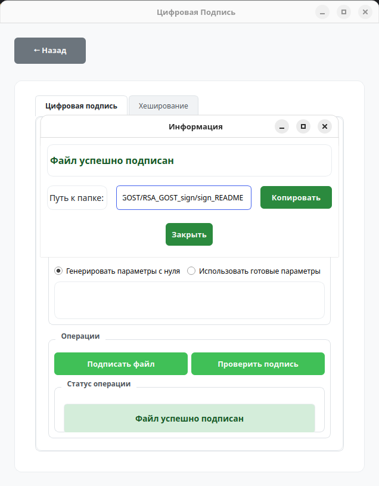
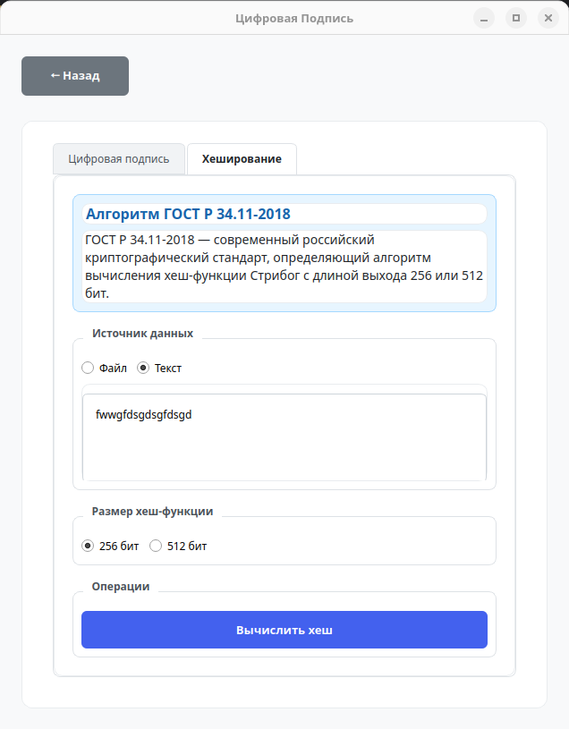

# RSA и ГОСТ Р 34.10-2018 Система Цифровой Подписи

Данный проект представляет собой программу с графическим интерфейсом для создания и проверки цифровых подписей с использованием алгоритмов RSA и ГОСТ Р 34.10-2018.

## Описание проекта

Программа позволяет:

1. **Подписывать файлы** с использованием алгоритмов:
   - RSA - криптографический алгоритм с открытым ключом, основанный на вычислительной сложности задачи факторизации больших целых чисел
   - ГОСТ Р 34.10-2018 - российский стандарт цифровой подписи, основанный на эллиптических кривых

2. **Проверять подписи** для подтверждения целостности и подлинности файлов

3. **Генерировать криптографические ключи** для обоих алгоритмов

## Структура проекта

Проект имеет модульную структуру:

- **RSA/** - модуль для работы с алгоритмом RSA
  - `rsa.py` - графический интерфейс для RSA
  - `sign_file.py` - функционал для подписи файлов
  - `check_sign.py` - функционал для проверки подписи
  - `gen_keys.py` - генерация ключей RSA
  - `gen_prime_nums.py` - генерация простых чисел
  - `miller_test.py` - тест Миллера-Рабина для проверки простоты
  - `lucas_test.py` - тест Люка для проверки простоты

- **GOST/** - модуль для работы с алгоритмом ГОСТ Р 34.10-2018
  - `gost.py` - графический интерфейс для ГОСТ
  - `sign_file.py` - функционал для подписи файлов
  - `check_sign.py` - функционал для проверки подписи
  - `gen_params.py` - генерация параметров эллиптической кривой
  - `stribog.py` - реализация хеш-функции ГОСТ Р 34.11-2018 (Стрибог)

- **constants/** - константы, используемые в алгоритмах

- **main.py** - главный файл программы, объединяющий модули RSA и ГОСТ

## Внешний вид

### Главный экран программы:



### Экран подписи RSA:



### Экран подписи GOST:



### Экран хэш-функции Стрибог:



## Установка и запуск

### Требования

Для работы программы требуется Ubuntu 20.04 и выше, Python 3.6+ и следующие библиотеки:

```
# Основные зависимости
PyQt6      # Для графического интерфейса
SageMath   # Для математических вычислений
numba      # Для оптимизации вычислений
numpy      # Для работы с массивами данных

# Дополнительные зависимости (для отдельных компонентов)
memory_profiler  # Для профилирования памяти (в тестах)
```

### Установка

#### Обновление пакетов:
```bash
sudo apt-get update
```

#### Установка MiniForge3:
```bash
curl -L -O "https://github.com/conda-forge/miniforge/releases/latest/download/Miniforge3-$(uname)-$(uname -m).sh"
bash Miniforge3-$(uname)-$(uname -m).sh
```

#### Перезапуск терминала:
```bash
source ~/.bashrc
```

#### Найти папку с установленным miniforge:
```bash
find ~ -type d -name "miniforge3" 
```

#### Вставить туда `export PATH="/path/to/miniforge/bin:$PATH"` (заменить `/path/to/miniforge` на ваш путь) после этого нужно перезапустить терминал:
```bash
nano ~/.bashrc
```

#### Проверка установки conda:
```bash
conda --version
```

#### Посмотреть настройки локали, должно быть en_US.UTF-8:
```bash
locale
```

#### Если не так, то установить пакет для настройки локали, после этого перезапустить терминал:
```bash
sudo apt-get install locales
sudo locale-gen en_US.UTF-8
```

#### Настройка локали:
```bash
export LANG=en_US.UTF-8
export LC_ALL=en_US.UTF-8
```

#### Сделать настройки постоянными, после этого перезагрузить терминал:
```bash
echo 'export LANG=en_US.UTF-8' >> ~/.bashrc
echo 'export LC_ALL=en_US.UTF-8' >> ~/.bashrc
```

#### Создание виртуального окружения с SageMath:
```bash
conda create -n sage sage python=3.12 -c conda-forge
```

#### Инициализация, после этого перезапустить терминал:
```bash
conda init
```

#### Активация окружения:
```bash
conda activate sage
```

#### Установка PyQt6:
```bash
pip install PyQt6
```

### Запуск программы

#### Вариант 1: Запуск с помощью виртуального окружения

##### Активация виртуального окружения:
```bash
source ~/miniforge3/bin/activate
conda activate sage
```

##### Запуск программы:
```bash
sage main.py
```

#### Вариант 2: Запуск с помощью Docker

Проект можно запустить в контейнере Docker, что упрощает установку и избавляет от необходимости устанавливать зависимости на локальной машине.

##### Предварительные требования:
- Установленный Docker и Docker Compose
- Настроенный X-сервер для отображения GUI (для Linux используется по умолчанию, для Windows можно установить X-сервер, например, VcXsrv)

##### Сборка и запуск в Docker:

1. Сборка образа (с корня проекта):
```bash
docker-compose build
```

2. Запуск контейнера:

   **Для Linux**:
   ```bash
   # Разрешить доступ к X-серверу
   xhost +
   
   # Запустить контейнер
   DISPLAY=$DISPLAY docker-compose up
   ```

   **Для Windows с VcXsrv**:
   ```bash
   # Запустить VcXsrv с настройками "Disable access control"
   
   # Затем запустить приложение в контейнере
   docker-compose up
   ```

   > Примечание: Если возникают проблемы с отображением GUI в Docker, можно использовать подход с xvfb внутри контейнера.

##### Примечания по Docker:
- Контейнер содержит все необходимые зависимости, включая SageMath, PyQt6, numba и прочее
- При необходимости, настройки проекта можно изменить в `docker-compose.yml`
- Исходный код проекта монтируется в контейнер, поэтому любые изменения в коде немедленно доступны в контейнере

## Использование

1. **Подпись файла**:
   - Выберите алгоритм (RSA или ГОСТ)
   - Нажмите кнопку "Обзор" и выберите файл для подписи
   - Нажмите кнопку "Подписать файл"
   - После успешной подписи вы получите сообщение и путь к папке с подписанным файлом

2. **Проверка подписи**:
   - Выберите алгоритм (RSA или ГОСТ)
   - Нажмите кнопку "Обзор" и выберите файл для проверки
   - Нажмите кнопку "Проверить подпись"
   - Программа отобразит результат проверки

## Безопасность

Программа использует криптографически стойкие алгоритмы:
- RSA с ключами достаточной длины
- ГОСТ Р 34.10-2018 с рекомендованными параметрами эллиптических кривых
- Хеш-функцию ГОСТ Р 34.11-2018 (Стрибог) для ГОСТ и SHA-256 для RSA
